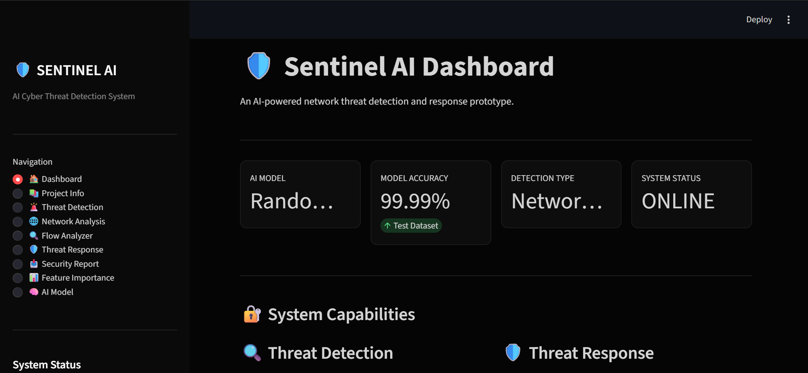
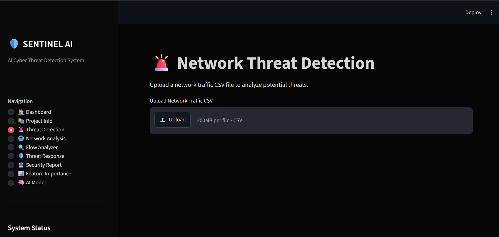
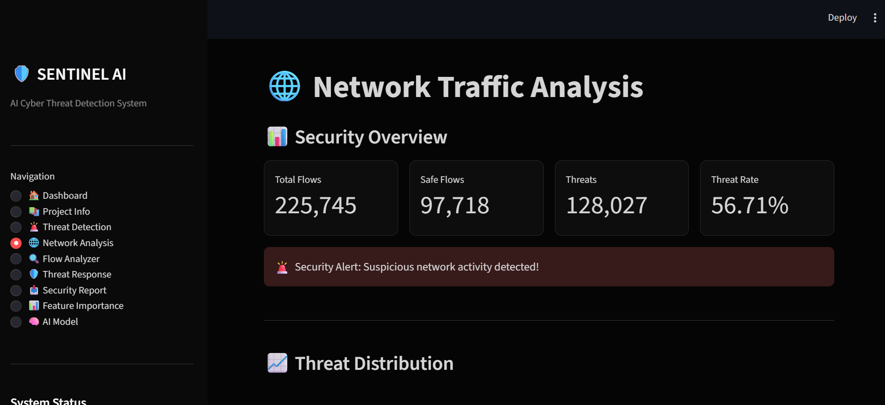
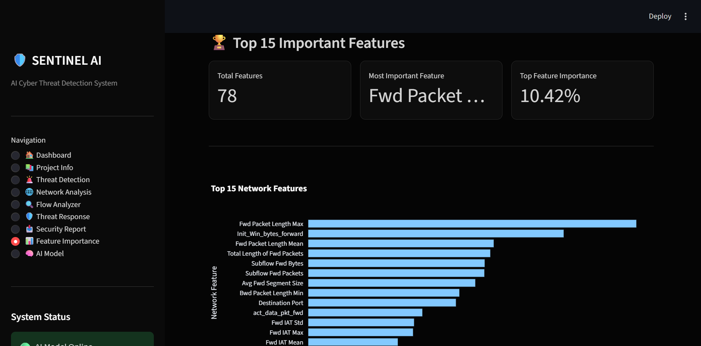
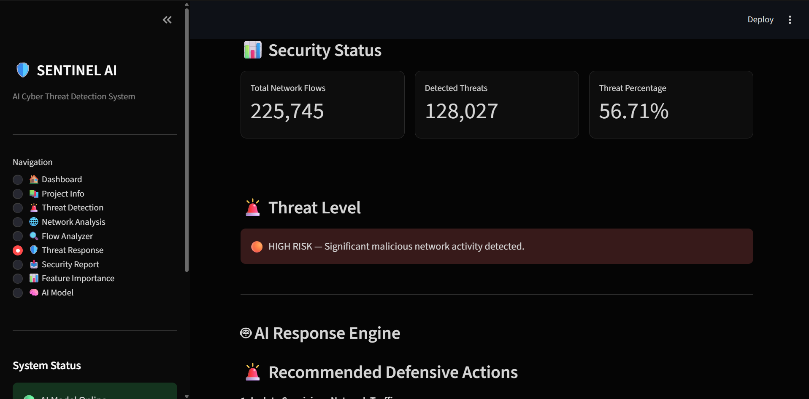

# 🛡️ Sentinel AI — AI Cyber Threat Detection & Response System

An AI-powered cybersecurity application built with **Python, Machine Learning, and Streamlit** to analyze network traffic and identify potential cyber threats, with a focus on **DDoS attack detection**.

---

## 📌 Project Overview

**Sentinel AI** is a machine-learning-based Cyber Threat Detection and Response System designed to analyze network traffic data and classify network activity as either:

* ✅ **BENIGN** — Normal network traffic
* 🚨 **DDoS** — Potential Distributed Denial-of-Service traffic

The system uses a **Random Forest Machine Learning model** trained on network-flow data from the **CICIDS2017 dataset**.

A Streamlit dashboard provides an interactive interface for uploading network traffic data, detecting threats, analyzing network activity, and generating security reports.

---

## 🎯 Project Objective

The main objective of Sentinel AI is to demonstrate how Machine Learning can assist cybersecurity teams in:

1. Analyzing network traffic
2. Detecting suspicious traffic patterns
3. Classifying potential threats
4. Understanding important network features
5. Visualizing network activity
6. Generating security reports
7. Simulating defensive threat-response actions

---

## 🚨 Problem Statement

Traditional cybersecurity systems often depend heavily on predefined rules and signatures.

However, modern network environments can generate huge amounts of traffic, making manual analysis difficult.

Sentinel AI demonstrates a machine-learning approach where network traffic features are analyzed automatically and classified into different traffic categories.

---

## 💡 Proposed Solution

Sentinel AI follows this workflow:

```text
Network Traffic Dataset
        ↓
Data Preprocessing
        ↓
Feature Extraction
        ↓
Train/Test Split
        ↓
Random Forest Model
        ↓
Threat Prediction
        ↓
Security Dashboard
        ↓
Threat Analysis
        ↓
Simulated Response
        ↓
Security Report
```

---

# 🧠 Machine Learning Model

The project uses a:

## Random Forest Classifier

Random Forest is an ensemble machine-learning algorithm that combines multiple decision trees.

Instead of relying on a single decision tree, Random Forest creates many trees and combines their predictions.

### Simple explanation

Imagine asking 100 security experts:

> "Is this network traffic normal or dangerous?"

Each expert makes a decision.

Random Forest combines their decisions to produce the final prediction.

---

# 📊 Dataset

The project uses network-flow data from the **CICIDS2017 cybersecurity dataset**.

The current project uses:

```text
Friday-WorkingHours-Afternoon-DDos.pcap_ISCX.csv
```

### Dataset information

| Property       |   Value |
| -------------- | ------: |
| Total Rows     | 225,745 |
| Total Columns  |      79 |
| Input Features |      78 |
| Target Column  |   Label |
| Training Split |     80% |
| Testing Split  |     20% |

### Classes

| Class  | Description                           |
| ------ | ------------------------------------- |
| BENIGN | Normal network traffic                |
| DDoS   | Distributed Denial-of-Service traffic |

Dataset distribution in the current file:

```text
DDoS     → 128,027
BENIGN   → 97,718
```

---

# 🔧 Data Preprocessing

Before training the machine-learning model, the dataset is cleaned.

### Steps performed

1. Load the CSV dataset
2. Remove unnecessary whitespace from column names
3. Separate input features from the target label
4. Handle infinite values
5. Replace missing values
6. Split the dataset into training and testing sets
7. Train the Random Forest model

Infinite values are handled using:

```python
X = X.replace([float("inf"), float("-inf")], float("nan"))
X = X.fillna(0)
```

---

# 🏋️ Model Training

The Random Forest model is configured using:

```python
RandomForestClassifier(
    n_estimators=100,
    random_state=42,
    n_jobs=-1
)
```

### Meaning

* `n_estimators=100` → 100 decision trees
* `random_state=42` → reproducible results
* `n_jobs=-1` → uses available CPU cores for training

---

# 📈 Model Results

The model was evaluated using a separate 20% test split.

### Test Accuracy

```text
99.9956%
```

### Confusion Matrix

```text
[[19543     1]
 [    1 25604]]
```

The classification report showed approximately:

| Class  | Precision | Recall | F1-Score |
| ------ | --------: | -----: | -------: |
| BENIGN |      1.00 |   1.00 |     1.00 |
| DDoS   |      1.00 |   1.00 |     1.00 |

### ⚠️ Important

The reported accuracy is the result obtained on this particular **CICIDS2017 test split**.

It should **not** be interpreted as 99.9956% real-world cybersecurity detection accuracy.

Real-world network environments contain different traffic patterns, network configurations, attack types, and previously unseen behavior.

---

# 🖥️ Application Features

## 🏠 Dashboard

Provides an overview of the Sentinel AI system.

Displays information such as:

* System status
* Model status
* Threat detection information
* Dataset information
* Application navigation

---

## 📚 Project Info

Explains:

* Project objective
* Machine-learning approach
* Dataset
* Technologies used
* Cybersecurity scope

---

## 🚨 Threat Detection

Allows users to upload a CSV network-traffic dataset.

The system:

```text
Upload CSV
   ↓
Validate Data
   ↓
Preprocess Features
   ↓
Machine Learning Model
   ↓
Prediction
   ↓
Threat Classification
```

Predictions are displayed as:

```text
BENIGN
```

or

```text
DDoS
```

---

## 🌐 Network Analysis

Provides visual analysis of the uploaded network traffic.

The dashboard can display:

* Traffic distribution
* Threat distribution
* Network statistics
* Traffic tables
* Visual analytics

---

## 🔍 Flow Analyzer

Allows individual network flows to be examined using their feature values.

This helps demonstrate how machine-learning predictions can be applied to individual network-flow records.

---

## 🛡️ Threat Response

The application demonstrates **simulated defensive response actions** after detecting a potential threat.

Example actions include:

```text
Threat detected
      ↓
Analyze traffic
      ↓
Generate alert
      ↓
Recommend defensive action
```

### Important

This project does **not** perform real firewall blocking, system modification, or offensive cybersecurity actions.

The response functionality is intentionally simulated for academic and demonstration purposes.

---

## 📥 Security Report

The system can generate downloadable security reports containing prediction results and relevant traffic information.

This demonstrates how detected threats could be documented for further analysis.

---

## 📊 Feature Importance

The Random Forest model provides feature-importance information.

This helps identify which network-flow features contributed most to the model's decision-making.

Feature importance can help answer:

> "Which network characteristics are most useful for distinguishing traffic classes?"

---

## 🧠 AI Model

The application also provides information about the trained machine-learning model, including:

* Algorithm
* Number of trees
* Dataset information
* Model status
* Prediction workflow

---

# 📸 Application Screenshots

## 🏠 Dashboard



---

## 🚨 Threat Detection



---

## 🌐 Network Analysis



---

## 📊 Feature Importance



---

## 🛡️ Threat Response



---

# 🏗️ Project Architecture

```text
                    ┌─────────────────────┐
                    │   Network Dataset   │
                    └──────────┬──────────┘
                               │
                               ↓
                    ┌─────────────────────┐
                    │ Data Preprocessing  │
                    └──────────┬──────────┘
                               │
                               ↓
                    ┌─────────────────────┐
                    │ Feature Processing  │
                    └──────────┬──────────┘
                               │
                               ↓
                    ┌─────────────────────┐
                    │   Random Forest     │
                    │   ML Classifier     │
                    └──────────┬──────────┘
                               │
                               ↓
                    ┌─────────────────────┐
                    │ Threat Prediction   │
                    └──────────┬──────────┘
                               │
              ┌────────────────┼────────────────┐
              ↓                ↓                ↓
       Threat Detection   Network Analysis   Reports
              │
              ↓
       Simulated Response
```

---

# 🛠️ Technologies Used

### Programming Language

* Python

### Machine Learning

* Scikit-learn
* Random Forest

### Data Processing

* Pandas
* NumPy

### Web Application

* Streamlit

### Visualization

* Plotly

### Model Serialization

* Joblib

### Development Environment

* Visual Studio Code
* Git
* GitHub

---

# 📁 Project Structure

```text
AI-Cyber-Threat-Detection/
│
├── app.py
├── train_model.py
├── threat_detection_model.pkl
├── README.md
├── .gitignore
│
├── data/
│   └── Friday-WorkingHours-Afternoon-DDos.pcap_ISCX.csv
│
└── screenshots/
    ├── dashboard.png
    ├── threat-detection.png
    ├── network-analysis.png
    ├── feature-importance.png
    └── threat-response.png
```

---

# ⚙️ Installation

## 1. Clone the repository

```bash
git clone https://github.com/JOEL7074/AI-Cyber-Threat-Detection.git
```

Move into the project directory:

```bash
cd AI-Cyber-Threat-Detection
```

---

## 2. Install required libraries

```bash
pip install pandas numpy scikit-learn streamlit plotly joblib
```

---

## 3. Train the model

Run:

```bash
python train_model.py
```

The trained model will be saved as:

```text
threat_detection_model.pkl
```

---

## 4. Start the application

Run:

```bash
python -m streamlit run app.py
```

The application will open in your browser.

If it does not open automatically, visit:

```text
http://localhost:8501
```

---

# 🔄 How the System Works

The complete process can be summarized as:

```text
CSV Network Traffic
        ↓
Data Cleaning
        ↓
Feature Selection
        ↓
Random Forest
        ↓
Prediction
        ↓
BENIGN / DDoS
        ↓
Visualization
        ↓
Security Report
        ↓
Simulated Defensive Response
```

---

# 🔐 Cybersecurity Scope

This project is designed for **defensive cybersecurity and academic demonstration**.

The system focuses on:

* Network traffic analysis
* Machine-learning-based threat detection
* DDoS classification
* Security visualization
* Threat reporting
* Simulated response

It does not include:

* Real-world attack execution
* Exploit development
* Malware
* Credential theft
* Unauthorized access
* Real firewall modification
* Offensive network operations

---

# ⚠️ Limitations

The current version has several limitations.

### 1. Dataset limitation

The model is trained using a specific portion of the CICIDS2017 dataset.

### 2. Attack coverage

The current implementation focuses primarily on the available BENIGN and DDoS classes in the selected dataset.

### 3. Offline analysis

The application analyzes uploaded CSV network-flow data rather than continuously monitoring a live network.

### 4. Simulated response

Threat-response actions are demonstrations and do not automatically modify real network infrastructure.

### 5. Generalization

Performance on the CICIDS2017 test split does not guarantee equivalent performance on unseen real-world traffic.

---

# 🚀 Future Enhancements

Potential future improvements include:

* Real-time network monitoring
* Additional attack classifications
* Larger and more diverse datasets
* Advanced anomaly detection
* Automated alerting
* SIEM integration
* Real-time dashboards
* Explainable AI
* Model retraining pipelines
* Cloud deployment
* Role-based access control
* Production-grade monitoring

---

# 🎓 Academic Significance

This project demonstrates the combination of:

```text
Artificial Intelligence
        +
Machine Learning
        +
Data Science
        +
Cybersecurity
        +
Python
        +
Web Application Development
```

It provides practical exposure to:

* Data preprocessing
* Classification
* Model training
* Model evaluation
* Feature importance
* Data visualization
* Machine-learning deployment
* Cybersecurity analytics

---

# 👶 Simple Explanation

Imagine a security guard watching thousands of cars entering a city.

The guard cannot manually inspect every car.

So we train an AI system using examples of:

```text
Normal traffic → BENIGN
Dangerous traffic → DDoS
```

When new traffic arrives, the AI looks at its characteristics and predicts:

```text
"Looks normal"
```

or

```text
"Potential threat"
```

Sentinel AI then displays the result on a cybersecurity dashboard.

---

# 💬 One-Line Project Explanation

> **Sentinel AI is a machine-learning-based cybersecurity system that analyzes network traffic and detects potential DDoS threats using a Random Forest classifier.**

---

# 🧑‍💻 Key Project Keywords

```text
Python
Machine Learning
Artificial Intelligence
Cybersecurity
Network Security
Intrusion Detection
DDoS Detection
Random Forest
Scikit-learn
Pandas
NumPy
Streamlit
Plotly
Data Analysis
Feature Importance
Threat Detection
Security Analytics
```

---

# 👨‍💻 Author

**JOEL**

B.Tech — Artificial Intelligence & Data Science

---

# ⚠️ Disclaimer

This project is developed for **educational, research, and defensive cybersecurity demonstration purposes**.

The reported machine-learning performance is based on the selected CICIDS2017 dataset and test split and should not be interpreted as guaranteed real-world cybersecurity performance.
